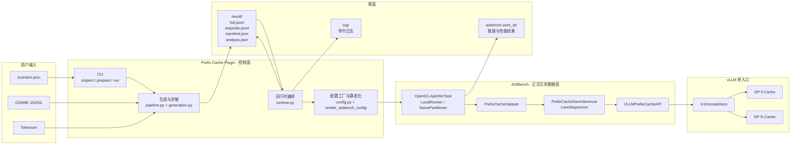
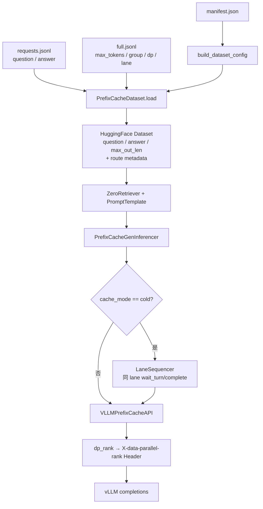
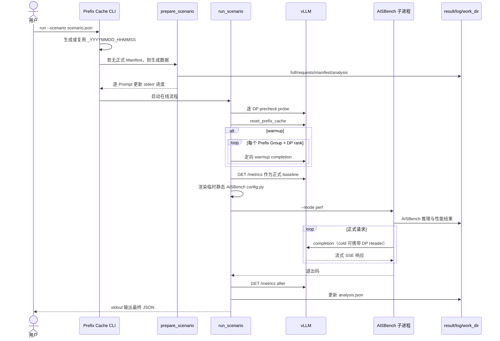

# 【AISBench】支持 Prefix Cache 场景化测试能力——需求与设计

## 1. 文档信息

| 项目 | 内容 |
|---|---|
| 文档状态 | 待评审 |
| 需求来源 | `【AISBench】支持Prefix Cache场景化测试能力.txt` |
| 参考总设计 | `【AISBench】Prefix Cache详细需求与设计.md` |
| 实现基线 | `0827_prefix_cache` 分支当前代码 |
| 适用模块 | `benchmark/plugins/prefix_cache` |
| 实现原则 | 不修改 AISBench 原有框架逻辑，通过独立插件、静态配置注入和自定义扩展类接入 |
| 服务范围 | 单一 vLLM HTTP 入口，支持入口内部多 DP；不支持多个独立 vLLM 实例 |

本文将原始场景化需求展开为可实现、可测试、可追踪的需求设计，并以当前代码行为作为实现口径。配置字段的完整说明以 `plugins/prefix_cache/config_examples/scenario.example.md` 为准。

## 2. 背景与目标

通用性能数据集通常只表达“若干互相独立的 Prompt”，无法稳定模拟 Prefix Cache 的历史依赖。真实业务具有以下特征：

1. 不同客户或业务使用不同系统 Prompt，形成多个互相隔离的 Prefix Group；
2. 同一组内请求共享 canonical 主前缀，但共享长度可能不同；
3. Cache 是否命中取决于同一缓存域此前已经处理过哪些请求；
4. cold-start 时缓存从空状态逐步建立，warmup 时正式请求开始前缓存已建立；
5. 多 DP 部署中，每个 DP 拥有独立缓存，路由和顺序会直接影响理论命中结果；
6. 场景数据既要交给 AISBench 正式压测，也要保留足够的审计信息用于复现和分析。

本能力的目标是形成以下闭环：

```text
场景配置 → 数据生成 → 理论规划 → AISBench 正式发送 → vLLM 执行 → 结果落盘
```

## 3. 参考资料与代码依据

### 3.1 需求资料

- `需求文档/详细文档/【AISBench】支持Prefix Cache场景化测试能力.txt`；
- `需求文档/【AISBench】Prefix Cache详细需求与设计.md`；
- `plugins/prefix_cache/README.md`；
- `plugins/prefix_cache/config_examples/scenario.example.md`；
- `plugins/prefix_cache/ARCHITECTURE.md`、`MODULES.md`。

### 3.2 关键代码

| 职责 | 文件 | 关键入口 |
|---|---|---|
| CLI 与任务外壳 | `ais_bench_prefix_cache/cli.py` | `main`、`PromptProgress` |
| Scenario 契约 | `ais_bench_prefix_cache/scenario.py` | `load_scenario`、`_validate`、`with_execution_timestamp` |
| 数据生成与求解 | `ais_bench_prefix_cache/generation.py` | `assign_groups`、`order_indices`、`solve_prefix_lengths`、`simulate_theory` |
| prepare/inspect 编排 | `ais_bench_prefix_cache/pipeline.py` | `prepare_scenario`、`inspect_scenario` |
| 产物契约 | `ais_bench_prefix_cache/artifacts.py` | `artifact_paths`、`validate_artifacts` |
| 在线运行编排 | `ais_bench_prefix_cache/runtime.py` | `run_scenario`、`render_aisbench_config` |
| AISBench 配置工厂 | `ais_bench_prefix_cache/config.py` | `build_dataset_config`、`build_model_config` |
| 数据集适配 | `datasets/prefix_cache_dataset.py` | `PrefixCacheDataset.load` |
| 发送顺序控制 | `openicl/.../prefix_cache_gen_inferencer.py` | `PrefixCacheGenInferencer`、`LaneSequencer` |
| vLLM API 适配 | `models/vllm_prefix_cache_api.py` | `VLLMPrefixCacheAPI` |
| AISBench 模板配置 | `config_examples/prefix_cache_perf.py` | `datasets`、`models`、`infer`、`work_dir` |

## 4. 范围

### 4.1 本期范围

- 单 Prefix Group 和多 Prefix Group；
- 每组独立 canonical 主前缀、理论缓存水位和理论命中统计；
- `sequential`、`within_group_shuffle`、`interleave`、`global_shuffle`、`input_len_asc` 五种顺序；
- cold-start 和 warmup 两种缓存初态；
- 单入口单 DP、单入口多 DP；
- cold 多 DP 确定性定向路由；
- warmup 对每个 `Prefix Group × DP rank` 独立预热；
- 场景驱动的数据生成、AISBench 配置生成和正式性能压测；
- 运行时间戳、进度条、分层日志、正式产物和校验。

### 4.2 明确不在本期范围

- 多个独立 vLLM 实例、多个 inference URL 或 metrics URL；
- 跨实例请求分配、实例级缓存水位和实例级指标聚合；
- 修改 AISBench 核心 Dataset、Task、Runner、Partitioner 或通用 API Model；
- 控制 vLLM 的缓存淘汰算法或容量管理策略；
- 服务端 Prefix Group 级实际命中率统计，因为 vLLM Prometheus 指标不包含 Group 标签。

## 5. 术语

| 术语 | 定义 |
|---|---|
| Scenario | 用户唯一直接编辑的 JSON 配置，描述数据、缓存、服务和 AISBench 运行参数 |
| Prefix Group | 共享同一 canonical 主前缀的一组正式请求 |
| canonical prefix | 组内稳定的主前缀 token 序列；不同组首个完整 block 必须可区分 |
| shared prefix | 单条请求从所属 canonical prefix 取用的前 `N` 个 token |
| unique seed | 位于共享前缀和自然后缀之间、全局唯一且边界安全的 token 序列 |
| natural suffix | 由一个或多个 GSM8K question 轮换、拼接、截断得到的自然文本后缀 |
| watermark | 某缓存域已经建立的最大连续 canonical 前缀长度 |
| lane | cold 模式下的 `(group_id, dp_rank)` 缓存域及发送序列 |
| formal request | 进入 AISBench 性能统计和正式命中率统计的请求 |
| warmup request | 仅建立缓存，不进入正式性能与命中率统计的请求 |

## 6. 需求总览

| ID | 需求 | 当前实现 |
|---|---|---|
| PC-SCENE-01 | 支持单 Prefix Group | `groups.count=1` |
| PC-SCENE-02 | 支持多个 Prefix Group | uniform/zipf/weights 分组，各组独立 canonical prefix |
| PC-SCENE-03 | 支持多种请求顺序 | 五种 `order.strategy` |
| PC-SCENE-04 | 支持 cold-start | 空水位理论模拟、确定性 DP 路由、lane 内有序发送 |
| PC-SCENE-05 | 支持 warmup | 每个 Group × DP 定向预热，预热后采正式 baseline |
| PC-SCENE-06 | 支持短到长建立 Cache | `input_len_asc` 按组内输入长度升序，cold lane 严格执行 |
| PC-SCENE-07 | 不改变 AISBench 核心 | 通过插件注册、配置工厂、自定义 Dataset/Inferencer/Model 接入 |
| PC-SCENE-08 | 保持目标命中率轨迹平稳 | target-convergent 求解，减少累计命中率超调和回落 |
| PC-SCENE-09 | 完整落盘和复现 | full/requests/manifest/analysis、日志、哈希、时间戳 |

## 7. 总体架构

插件与 AISBench 采用“控制面 + 正式压测数据面”分工：

- Prefix Cache 插件负责 Scenario、数据集构造、理论规划、缓存初态、vLLM 能力检查、配置注入和运行后分析；
- AISBench 负责正式任务切分、Runner 调度、请求生命周期和性能结果汇总；
- 插件扩展类运行在 AISBench 子进程中，把审计元数据转换成逐请求路由和 lane 顺序约束；
- vLLM 是被测服务，接收正式请求并维护真实 Prefix/KV Cache。



## 8. Plugin 与 AISBench 联动设计

### 8.1 联动边界

AISBench 不直接读取完整 Scenario，也不负责生成 Prefix Cache 数据。插件先把用户配置展开为稳定产物和 AISBench 静态配置，再启动 AISBench。双方以以下对象作为边界：

| 边界对象 | 生产方 | 消费方 | 作用 |
|---|---|---|---|
| `scenario.json` | 用户 | 插件 | 唯一用户配置入口 |
| `manifest.json` | 插件 prepare | 插件配置工厂、Dataset、runtime | 定位产物、校验配置指纹和运行口径 |
| `requests.jsonl` | 插件 prepare | `PrefixCacheDataset` | 保存最小业务字段，默认只有 question/answer |
| `full.jsonl` | 插件 prepare | `PrefixCacheDataset` | 保存 max_tokens、group、DP、lane 和理论审计字段 |
| 临时静态 `config.py` | 插件 runtime | AISBench CLI | 提供可被 mmengine 直接加载的 datasets/models/infer/work_dir |
| AISBench 输出目录 | AISBench | 用户、插件分析引用 | 保存 TTFT、TPOT、ITL、吞吐和推理结果 |

### 8.2 为什么需要静态化 AISBench 配置

模板 `prefix_cache_perf.py` 会读取环境变量并调用 Python 工厂函数。AISBench 的 mmengine 配置加载要求最终配置可静态解析，因此 `render_aisbench_config` 执行以下转换：

1. 设置本次执行对应的 Scenario、Manifest 和 work_dir 环境变量；
2. 在插件进程中执行模板配置；
3. 取得 `datasets`、`models`、`infer` 及 summarizer 等可序列化项；
4. 将类对象转换为显式 import 别名；
5. 在临时目录写出不再依赖环境变量和工厂调用的静态 `config.py`；
6. 调用 `python -m ais_bench.benchmark.cli.main <静态配置> --mode perf`。

环境变量契约如下：

| 环境变量 | 内容 | 用途 |
|---|---|---|
| `AISBENCH_PREFIX_CACHE_SCENARIO` | 原始 Scenario 绝对路径 | 配置工厂重新加载用户配置 |
| `AISBENCH_PREFIX_CACHE_MANIFEST` | 当前时间戳执行的 Manifest 绝对路径 | 防止误用旧产物 |
| `AISBENCH_PREFIX_CACHE_WORK_DIR` | AISBench 结果目录 | 控制 AISBench 正式结果落盘位置 |

### 8.3 AISBench 子进程内的数据转换



关键约束：

- `PrefixCacheDataset` 先调用 `validate_artifacts`，再逐行合并 requests/full；
- `sequence_index` 必须与物理行号一致，避免路由元数据错配；
- `max_out_len` 始终取自 full 审计数据，即使 requests 不输出 max_tokens；
- `PrefixCacheGenInferencer` 检查 AISBench 未改变数据行数和顺序；
- cold 模式只串行同一 lane，不同 lane 仍可并发；
- `VLLMPrefixCacheAPI` 在发请求前移除内部 `_aisbench_prefix_cache_dp_rank` 字段，避免污染 vLLM JSON body。

### 8.4 插件注册与调用 AISBench 机制

插件与 AISBench 之间是**双向**接入关系：

- **AISBench → 插件（发现/加载）**：通过 `entry_points` 入口点 + 注册表（Registry）发现插件，并触发插件类注册；
- **插件 → AISBench（调用/复用）**：通过继承 AISBench 基类、引用 AISBench 核心类，以及运行时用子进程启动 `ais_bench.benchmark.cli.main` 复用 AISBench 压测框架。

#### 入口点注册（插件侧唯一必需的“挂载点”）

`plugins/prefix_cache/setup.py` 声明 AISBench 约定的入口点组：

```python
entry_points={
    "ais_bench.benchmark_plugins": [        # AISBench 约定的插件入口点组名
        "prefix_cache = ais_bench_prefix_cache",
    ],
    "console_scripts": [
        "ais-bench-prefix-cache = ais_bench_prefix_cache.cli:console_main",
    ],
}
```

`ais_bench.benchmark_plugins` 与框架示例 `plugin_examples/setup.py` 使用的组名完全一致。

**注意：这段 `entry_points` 只是声明，本身不产生任何运行时效果。** 注册生效需要完整三步：

1. `setup.py` 声明 `entry_points`（如上）；
2. 执行 `pip install`，setuptools 才会把声明写入当前 Python 环境的 `site-packages/<dist>.dist-info/entry_points.txt`，从而进入 `importlib.metadata`；
3. AISBench 运行时由 `registry.py` 读取这些**已安装**的 entry point，才会真正导入插件。

因此，若未执行 `pip install`，或 `ais-bench-prefix-cache` 与 `ais_bench` 安装在不同 Python 环境（不同 `site-packages`），该插件**不会被 AISBench 发现**，`registry.py` 的 `get_plugin_locations` 返回空，三个 Registry 中也不会出现插件类。

框架侧在 `ais_bench/benchmark/registry.py` 消费该入口点：

```python
def get_plugin_locations(module_dir):
    for entry_point in entry_points().select(group='ais_bench.benchmark_plugins'):
        pkg = entry_point.load()                 # 导入 ais_bench_prefix_cache
        pkg_dir = pkg.__name__                   # => "ais_bench_prefix_cache"
        custom_loc = f'{pkg_dir}.{module_dir}'   # => 如 "ais_bench_prefix_cache.models"
        _ = __import__(custom_loc, fromlist=["*"])  # 导入子包，触发 @XX.register_module()
        locations.append(custom_loc)
```

插件无需显式声明子模块清单，AISBench 按固定的 `module_dir` 名拼接并导入插件同名子包，触发子包内的 `@XX.register_module()` 装饰器完成注册。

#### 三个注册表（Registry）

| Registry（框架内定义） | 插件同名子包 | 注册的类 | 注册位置 |
|---|---|---|---|
| `LOAD_DATASET`（`registry.py:71`） | `ais_bench_prefix_cache/datasets` | `PrefixCacheDataset` | `datasets/prefix_cache_dataset.py` `@LOAD_DATASET.register_module()` |
| `MODELS`（`registry.py:69`） | `ais_bench_prefix_cache/models` | `VLLMPrefixCacheAPI` | `models/vllm_prefix_cache_api.py` `@MODELS.register_module()` |
| `ICL_INFERENCERS`（`registry.py:77`） | `ais_bench_prefix_cache/openicl/icl_inferencer` | `PrefixCacheGenInferencer` | `openicl/icl_inferencer/prefix_cache_gen_inferencer.py` `@ICL_INFERENCERS.register_module()` |

插件调用 AISBench 的三条路径：

1. **静态引用核心类**：`config.py` 的 `build_dataset_config`/`build_model_config` 直接引用 `PromptTemplate`、`ZeroRetriever`、`AccEvaluator` 等框架自带类，与插件类一起组装成 `infer_cfg`/`eval_cfg`；
2. **继承核心基类**：`PrefixCacheDataset(BaseDataset)`、`VLLMPrefixCacheAPI(VLLMCustomAPI)`、`PrefixCacheGenInferencer(GenInferencer)` 继承 AISBench 基类，被 AISBench 的 Task/Runner 生命周期正常驱动；
3. **子进程启动 CLI**：`runtime.py` 的 `render_aisbench_config` 静态化配置后，以 `python -m ais_bench.benchmark.cli.main <静态config> --mode perf` 子进程方式驱动 AISBench 正式压测。

> **一句话总结**：`pip install` 安装 `ais-bench-prefix-cache` 后，其 `setup.py` 声明的 `ais_bench.benchmark_plugins` 入口点被写入 `importlib.metadata`，AISBench 的 `registry.py` 才能发现并 `__import__` 它的同名子包，进而在 `LOAD_DATASET`、`MODELS`、`ICL_INFERENCERS` 三个 Registry 上注册 `PrefixCacheDataset`、`VLLMPrefixCacheAPI`、`PrefixCacheGenInferencer`；这三个类又继承自 AISBench 的 `BaseDataset`/`VLLMCustomAPI`/`GenInferencer`，配合 `config.py` 引用的 `PromptTemplate`/`ZeroRetriever`/`AccEvaluator` 和模板里的 `NaivePartitioner`/`LocalRunner`/`OpenICLApiInferTask`，最终由 `runtime.py` 以 `python -m ais_bench.benchmark.cli.main <静态config> --mode perf` 子进程方式驱动 AISBench 完成正式压测。

## 9. 端到端运行时序



## 10. Scenario 配置设计

### 10.1 顶层配置

| 段 | 场景作用 |
|---|---|
| `run` | 基础 run_id、随机种子、输出目录和覆盖策略 |
| `tokenizer` | Prompt token 口径和 Prefix Cache block 大小 |
| `corpus` | GSM8K 路径、字段和选样方式 |
| `requests` | 请求数、输入长度和输出长度分布 |
| `output` | 控制 requests.jsonl 是否输出 max_tokens/output_tokens |
| `prefix_cache` | cold/warmup、目标命中率、seed、分组和顺序 |
| `service` | vLLM 地址、DP、reset、超时、KV 轮询周期 |
| `validation` | 目标偏差和实际偏差告警阈值 |
| `aisbench` | 模板配置、work_dir、额外参数、Dataset 与 Model 参数 |

未知字段必须在配置期报错。`poll_interval_seconds` 属于 `service`，不得配置在 `prefix_cache` 下。

### 10.2 用户可配置与框架固定契约

所有用户可调参数均来自 Scenario；`config.py` 只保留内部组装逻辑。以下字段虽然位于 Scenario，但受 Prefix Cache 数据口径约束：

- `aisbench.dataset.input_columns` 固定为 `['question', 'max_out_len']`；
- `aisbench.dataset.output_column` 固定为 `answer`；
- `aisbench.dataset.prompt_template` 固定为 `{question}`，避免附加模板改变理论 token 数；
- `aisbench.model.attr` 固定为 `service`，确保性能 Summarizer 不跳过该模型；
- `aisbench.model.stream` 默认 `true`，用于采集 TTFT/TPOT/ITL。

## 11. 数据生成设计

### 11.1 Prompt 布局

```text
[所属 Group 的 canonical prefix 前 N token]
[全局唯一 seed block]
[自然 GSM8K suffix]
```

必须满足：

```text
actual_input_tokens
  = shared_prefix_tokens
  + seed_tokens
  + natural_suffix_tokens
```

### 11.2 GSM8K 选样

支持 `random`、`indices`、`question_sha256` 和 `mixed`。组级 override 可以独立覆盖语料选择。自然后缀按组内出现次数轮换语料池；文本不足时继续拼接样本，超过目标时按 token 截断。

### 11.3 Prefix Group

- `uniform`：请求数尽量平均；
- `zipf`：按 Zipf 指数形成热点分布；
- `weights`：按显式权重归一化并分配整数请求数；
- 每条正式请求只属于一个 Group；
- 每组独立生成 canonical prefix；
- 首 block 碰撞时确定性轮换语料，仍碰撞则加入组标记重新构造；
- Manifest 记录每组 canonical 哈希、来源样本、最大共享长度、可达区间和理论命中率。

### 11.4 唯一 seed

seed 长度为 `tokenizer.block_size × prefix_cache.seed_blocks`。每条正式请求使用由全局随机种子和 request_id 派生的唯一 token 序列；warmup 使用独立 request_id 命名空间。seed 既阻断规划前缀之后的意外命中，也保证组内和跨组请求在边界后立即分叉。

### 11.5 目标驱动求解

每条请求最大共享前缀容量为：

```text
cap_i = floor((input_i - minimum_non_shared_length) / block_size) × block_size
```

求解器先计算全局可达最小/最大命中量，再把目标命中 token 调整到最近的 block 对齐可达值。最终命中 token 是硬约束，累计曲线平稳是次级优化目标：

- warmup：按累计输入 token 比例均衡分摊命中 block，避免前几条先堆满；
- cold：以 lane 水位为状态执行 beam search，优先最小化累计命中率超调、超调总量、回落和目标距离；
- 搜索受限时回退 exact-lane 构造，保证最终理论命中量正确。

## 12. 请求顺序与 Cache 建立

| 策略 | 行为 | 典型用途 |
|---|---|---|
| `sequential` | 保留生成顺序 | 固定可复现场景 |
| `within_group_shuffle` | 组内确定性打乱，组间顺序保持 | 模拟同业务内部随机访问 |
| `interleave` | 各 Group 轮转交错 | 模拟多租户交替访问 |
| `global_shuffle` | 全局确定性打乱 | 模拟无明显分组顺序的混合流量 |
| `input_len_asc` | 每组按输入长度升序，再组间轮转 | 模拟短请求到长请求逐步建立 Cache |

理论模拟必须使用最终发送顺序。`input_len_asc` 不只是修改 JSONL 行序；cold 模式下 AISBench 子进程还通过 `LaneSequencer` 保证同一 lane 的实际发送顺序与 Manifest 一致，因此在并发压测时仍能实现“短到长逐步建立 Cache”。

## 13. cold 与 warmup 设计

### 13.1 cold-start

缓存域定义为 `(group_id, dp_rank)`，初始水位为 0：

```text
hit_i = min(shared_prefix_i, watermark_before_i)
watermark_after_i = max(watermark_before_i, shared_prefix_i)
```

- 正式请求按组内 round-robin 分配 DP；
- `full.jsonl` 保存 `dp_rank` 与 `lane_sequence`；
- 模型仅在多 DP 时发送 `X-data-parallel-rank`；
- 同一 lane 严格有序，不同 lane 可并发；
- Prefix Group 之间、DP 之间均独立维护理论水位。

### 13.2 warmup

- prepare 为每个 `Prefix Group × DP rank` 生成一条 warmup 请求；
- warmup 覆盖该组正式请求的最大共享前缀；
- runtime 校验计划不重不漏并逐项定向发送；
- 单 DP 不发送路由 Header；
- warmup 请求不写入 requests.jsonl，不进入 AISBench；
- warmup 完成后才采集正式 baseline；
- 正式请求由 vLLM 内部负载均衡，因所有 DP 已获得等价组前缀而不要求逐请求 rank。

## 14. 产物、日志与目录

每次 `inspect`、`prepare`、`run` 使用同一格式的时间戳：

```text
<base_run_id>_YYYYMMDD_HHMMSS
<base_output_dir>_YYYYMMDD_HHMMSS/
```

目录分层：

```text
<output_dir_时间戳>/
├── log/
│   └── <run_id_时间戳>.<command>.log
└── result/
    ├── <run_id_时间戳>.full.jsonl
    ├── <run_id_时间戳>.requests.jsonl
    ├── <run_id_时间戳>.manifest.json
    └── <run_id_时间戳>.analysis.json
```

AISBench 正式性能结果单独写入 `aisbench.work_dir`。`inspect` 只保留日志和轻量 Manifest，不生成独立 inspect.json，也不保留正式 full/requests/analysis。

## 15. 异常、告警与退出码

以下属于硬错误，CLI 返回 2：

- Scenario 未知字段、非法模式或长度无法容纳非共享区；
- tokenizer/corpus 无法读取；
- canonical prefix、seed 或 Prompt round-trip 校验失败；
- 产物行数、行序、字段或哈希不一致；
- 多 DP 指标缺 rank、路由能力不足；
- reset/warmup/AISBench 正式执行失败。

以下只写入 warning，成功流程仍返回 0：

- 理论命中率与用户目标偏差超过 `target_warning_pp`；
- 实际命中率与理论值偏差超过 `actual_warning_pp`；
- 目标因 block 对齐或容量约束不可达；
- 用户显式启用 `assume_empty_cache`。

## 16. 测试设计

### 16.1 单元测试

- 单组/多组和 uniform/zipf/weights；
- 五种顺序策略；
- `input_len_asc` 短到长顺序；
- cold 分 DP 水位与路由；
- warmup Group × DP 覆盖；
- target-convergent warmup/cold 曲线；
- canonical 跨组隔离和全局唯一 seed；
- Scenario 默认值、未知字段和固定 AISBench 契约。

### 16.2 组件测试

- prepare 每生成一条 Prompt 进度加一；
- 四类产物和分层目录正确；
- Dataset 合并最小请求与审计路由字段；
- Inferencer 在任务逆序创建时仍按 lane_sequence 发送；
- Model 仅在需要时添加 DP Header；
- 静态 AISBench config 指向本次时间戳 Manifest。

### 16.3 集成测试

- mock vLLM 覆盖 precheck/reset/warmup/formal/after；
- 单 DP、冷启动多 DP、warmup 多 DP；
- AISBench 子进程退出码传播；
- 正式请求数和 Manifest 行数一致；
- warmup 不进入 AISBench 正式统计。

## 17. 验收标准

| ID | 验收项 | 通过条件 |
|---|---|---|
| PC-SCENE-A01 | 单 Prefix | `groups.count=1` 可完成 prepare/run |
| PC-SCENE-A02 | 多 Prefix | 每组 canonical 哈希不同，并分别输出理论统计 |
| PC-SCENE-A03 | 请求顺序 | 五种策略均可复现，理论模拟使用最终行序 |
| PC-SCENE-A04 | cold 水位 | 首请求按空缓存计算，后续按各 lane 历史推进 |
| PC-SCENE-A05 | 短到长 | `input_len_asc` 下同组/lane 实际发送非递减 |
| PC-SCENE-A06 | warmup | 每个 Group 在每个 DP 上均预热且不进入正式统计 |
| PC-SCENE-A07 | 框架联动 | 通过静态 config 启动 AISBench，不修改核心框架 |
| PC-SCENE-A08 | DP 路由 | cold 多 DP 的正式请求携带正确 rank Header |
| PC-SCENE-A09 | 目标轨迹 | 最终理论命中量精确命中 effective target，过程减少明显超调 |
| PC-SCENE-A10 | 产物 | result/log/work_dir 分层清晰，产物可重新校验 |

## 18. 需求追踪与实现结论

| 原始需求 | 设计章节 | 实现结论 |
|---|---|---|
| 单前缀场景 | 11.3、13 | 已实现 |
| 多前缀、独立主前缀 | 11.3 | 已实现 |
| 各组独立水位 | 13 | 已实现；cold 为 Group × DP，warmup 为 Group 初始水位 |
| 各组独立命中率 | 11.3、13 | 理论统计已实现；服务端实际 Group 统计受指标标签限制 |
| 顺序、组内乱序、交错、全局 shuffle | 12 | 已实现，并额外支持 `input_len_asc` |
| 无预热、首次 miss、后续建立 Cache | 13.1 | 已实现 |
| 短请求到长请求逐步建立 Cache | 12、13.1 | 已实现；排序与 lane 调度共同保证 |
| 理论目标误差告警 | 15 | 已实现，超阈值只告警 |
| Plugin 与 AISBench 联动 | 7～9 | 已实现，采用产物 + 静态 config + 扩展类联动 |

