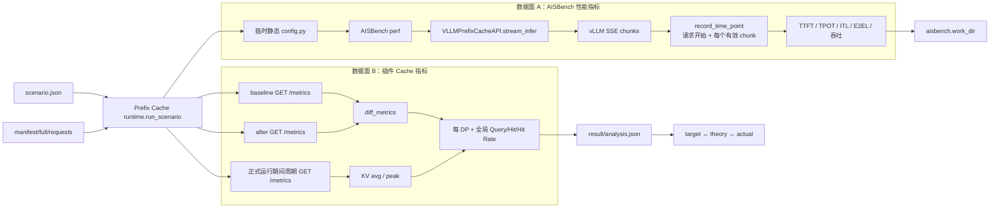
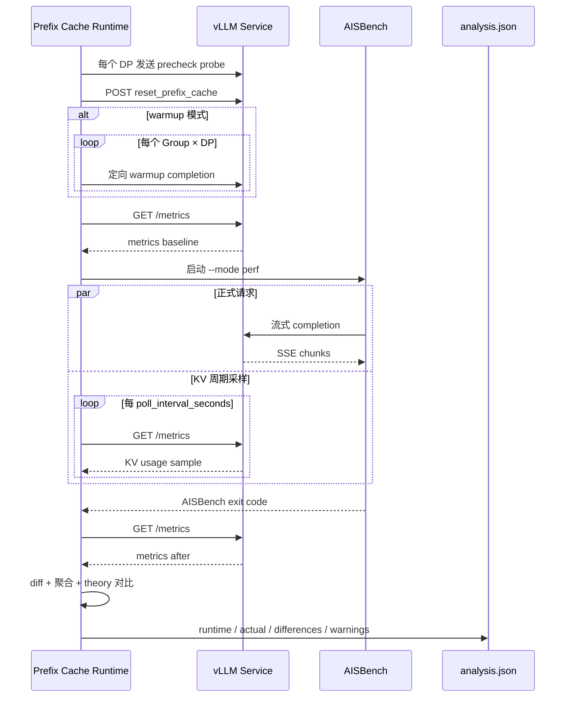

# 【AISBench】支持 Prefix Cache 指标采集与分析能力——需求与设计

## 1. 文档信息

| 项目 | 内容 |
|---|---|
| 文档状态 | 待评审 |
| 需求来源 | `【AISBench】支持Prefix Cache指标采集与分析能力.txt` |
| 参考总设计 | `【AISBench】Prefix Cache详细需求与设计.md` |
| 实现基线 | `0827_prefix_cache` 分支当前代码 |
| 适用模块 | `benchmark/plugins/prefix_cache` |
| 被测服务 | vLLM OpenAI-compatible API + Prometheus `/metrics` |
| 部署范围 | 单一服务入口，支持内部多 DP；多独立实例不在本期范围 |

本文重点定义 Prefix Cache 插件与 AISBench 的指标职责边界、采集阶段、数据流、计算口径、分析产物和验收标准。配置字段完整说明以 `plugins/prefix_cache/config_examples/scenario.example.md` 为准。

## 2. 背景与目标

离线理论命中率只能证明“数据按设计应当命中多少”，不能证明被测服务实际发生了同等命中。实际结果还会受到以下因素影响：

- vLLM Prefix Cache 实现与 block 语义；
- DP 路由和各 DP 独立缓存；
- reset 是否有效、warmup 是否覆盖全部 DP；
- 服务在正式压测前是否已有缓存或累计计数；
- KV Cache 容量、占用和运行期间的缓存淘汰；
- 请求失败、并发顺序和指标标签完整性。

本能力需要同时回答两类问题：

1. Prefix Cache 是否按理论规划命中：query、hit、hit rate、理论/实际偏差；
2. Prefix Cache 场景下服务性能如何：TTFT、TPOT、ITL、E2EL、吞吐及 KV Cache Usage。

## 3. 范围与需求裁剪

### 3.1 本期范围

- vLLM Prefix Cache query/hit 累计计数采集；
- baseline/after 差值计算；
- 单 DP 和单入口多 DP；
- `engine` 标签到 DP rank 的自动或显式映射；
- 每 DP 实际命中率和全局 token 加权命中率；
- 正式运行期间 KV Cache Usage 周期采样、均值和峰值；
- AISBench 流式请求的 TTFT/TPOT/ITL/E2EL 等性能数据；
- 理论目标、理论结果、实际结果的关联；
- cold/warmup 阶段隔离；
- warning-only 偏差策略；
- 保存原始 Prometheus 文本以供审计和离线复算。

### 3.2 多实例需求裁剪

原始需求包含“多实例统计”。根据当前产品范围和代码实现，本期已删除多独立实例设计，只支持：

```text
一个 inference_url + 一个 metrics_url + 一个可选 reset_url + dp_size 个 DP rank
```

因此：

- 支持 DP 域级和全局聚合；
- 不支持多个独立 vLLM 实例的实例级聚合；
- Scenario 出现实例列表或多个 URL 时会因严格字段白名单被拒绝；
- 后续如恢复多实例，需要新增实例身份、实例内 DP 映射、跨实例路由和双层聚合口径，不得复用当前 `dp_size` 冒充实例数。

## 4. 术语与统计口径

| 术语 | 定义 |
|---|---|
| metrics baseline | 正式 AISBench 压测开始前采集的 vLLM 累计指标快照 |
| metrics after | 正式 AISBench 压测结束后采集的累计指标快照 |
| query delta | `after_queries - baseline_queries`，表示正式统计窗口内的 Prefix Cache 查询量 |
| hit delta | `after_hits - baseline_hits`，表示正式统计窗口内的 Prefix Cache 命中量 |
| actual hit rate | `Σhit_delta / Σquery_delta` |
| theoretical hit rate | `Σtheoretical_hit_tokens / Σactual_input_tokens` |
| KV Cache Usage | vLLM gauge，反映采样时点的 KV Cache 使用比例 |
| AISBench 性能指标 | 由正式流式响应时间点计算的 TTFT、TPOT、ITL、E2EL、吞吐等 |
| DP 域 | 一个拥有独立 Prefix/KV Cache 的 data-parallel rank |

命中率采用 token 加权口径，不对请求命中率或 DP 百分比做简单平均。

## 5. 需求总览

| ID | 需求 | 当前实现 |
|---|---|---|
| PC-METRIC-01 | 采集 Prefix Cache Query/Hit | Prometheus 指标解析与别名兼容 |
| PC-METRIC-02 | 计算实际 Hit Rate | baseline/after 按 DP 求差，再全局汇总 |
| PC-METRIC-03 | 采集 KV Cache Usage | 正式运行期间周期轮询，输出 avg/peak/after |
| PC-METRIC-04 | 支持多 DP | engine 标签映射、rank 完整性校验、分 DP 输出 |
| PC-METRIC-05 | 理论与实际关联 | analysis.json 同时保存 target/theory/actual/difference |
| PC-METRIC-06 | 排除 precheck/warmup 污染 | reset 之后、warmup 之后采正式 baseline |
| PC-METRIC-07 | 采集 TTFT 等性能指标 | AISBench 流式 SSE 时间点和 service 类型汇总 |
| PC-METRIC-08 | 支持离线复算 | `analyze --baseline --after` |
| PC-METRIC-09 | 偏差不影响退出码 | 超阈值记录 PASS_WITH_WARNING |

## 6. 总体架构与双指标数据面

Prefix Cache 专项运行包含两条并行但职责不同的数据面：

1. AISBench 性能数据面：正式请求和流式响应时间点；
2. 插件 Cache 指标数据面：vLLM `/metrics` 快照、差值和 KV 轮询。

两条数据面以同一次正式 AISBench 子进程的开始与结束作为共同统计窗口，最终在不同目录落盘。



## 7. Plugin 与 AISBench 联动关系

### 7.1 职责分工

| 组件 | 指标职责 |
|---|---|
| Prefix Cache runtime | 控制 precheck/reset/warmup/baseline/formal/after 阶段，轮询 `/metrics`，计算 Cache 实际值 |
| AISBench Runner/Task | 执行正式请求，管理请求并发、成功状态和性能结果 |
| PrefixCacheDataset | 将 full 的 max_tokens、DP、Group、lane 元数据合并到正式 Dataset |
| PrefixCacheGenInferencer | cold 模式保证同 lane 请求顺序，防止实际到达次序与理论水位不一致 |
| VLLMPrefixCacheAPI | 发送 vLLM completion，注入 DP Header，记录流式响应时间点 |
| vLLM `/metrics` | 提供累计 query/hit counter 和 KV usage gauge |
| analysis.json | 汇总插件控制阶段、实际 Cache 指标、理论差异和 warning |
| `aisbench.work_dir` | 保存 AISBench 自身的推理明细和性能汇总 |

其中 `requests.jsonl` 提供正式 Prompt，`full.jsonl` 提供逐请求输出长度、理论命中和路由审计字段，`manifest.json` 提供三者的路径与 SHA-256 契约。AISBench 子进程只能在三者校验一致后启动。

### 7.2 联动不是“插件代替 AISBench”

插件 runtime 只直接发送 precheck、reset、warmup 三类控制请求。正式数据集仍由 AISBench 使用原有 `OpenICLApiInferTask`、`LocalRunner` 和 `NaivePartitioner` 执行。插件仅通过注册的 Dataset、Inferencer 和 Model 补充 Prefix Cache 所需语义。

### 7.3 配置联动

`runtime.render_aisbench_config` 将 Scenario 和 Manifest 路径注入模板配置，调用：

- `build_dataset_config(scenario)`；
- `build_model_config(scenario)`。

随后生成静态 AISBench 配置。正式命令为：

```text
python -m ais_bench.benchmark.cli.main <generated_config.py> --mode perf
```

`aisbench.extra_args` 追加到该命令。AISBench 的 Dataset/Model 参数来自 Scenario，插件代码只保留类型、产物路径、路由字段等内部固定契约。

## 8. 在线阶段时序与统计窗口



统计窗口的关键边界：

- precheck 发生在正式 baseline 之前；无论 reset 是否清零累计 counter，probe 都位于 baseline 之前，因此不进入 `after - baseline` 的正式增量；
- warmup 发生在 baseline 之前，warmup 计数不会进入正式增量；
- baseline 在所有 warmup 成功后采集；
- after 在 AISBench 成功退出后采集；
- 正式实际指标只使用 baseline 与 after 之间的增量。

## 9. 运行前能力检查

`VLLMClient.precheck` 执行：

1. 对 `0..dp_size-1` 每个 rank 发送一条 `max_tokens=1` probe；
2. 多 DP 时添加 `X-data-parallel-rank`，单 DP 不添加；
3. 获取一次 `/metrics`；
4. 检查 query/hit 指标存在；
5. 检查解析出的 DP rank 集合完整；
6. 在 analysis 的 `runtime.precheck` 保存 ranks 和实际 metric names。

precheck 通过只代表服务具备基本能力。正式缓存初态仍由后续 reset/warmup 建立。

## 10. reset、cold 与 warmup

### 10.1 reset

- 配置 `reset_url` 时，正式运行前调用 `POST`；
- reset 失败默认终止；
- 仅当用户明确设置 `assume_empty_cache=true` 时允许继续，并记录 `ASSUME_EMPTY_CACHE`；
- 不允许静默假设缓存为空。

### 10.2 cold

- reset 后直接采 baseline；
- 正式请求按 Manifest 的 `dp_rank` 定向；
- `LaneSequencer` 维持同一 `(group, rank)` 的顺序；
- 可输出 cold 分 DP 理论值，与每 DP 实际值对照。

### 10.3 warmup

- runtime 校验 warmup plan 是否完整覆盖全部 Group × DP；
- 每项 warmup 保存 group、rank、成功状态和耗时；
- warmup 全部完成后重新采 baseline；
- 正式请求不需要固定 DP，由 vLLM 内部负载均衡；
- warmup 不进入 requests.jsonl、AISBench 性能统计、理论分母或实际 counter delta。

## 11. Prometheus 指标解析设计

### 11.1 指标别名

代码按以下优先顺序选择实际出现的名称：

| 逻辑指标 | 支持的名称 |
|---|---|
| queries | `vllm:prefix_cache_queries`、`vllm:prefix_cache_queries_total`、`vllm:gpu_prefix_cache_queries`、`vllm:gpu_prefix_cache_queries_total` |
| hits | `vllm:prefix_cache_hits`、`vllm:prefix_cache_hits_total`、`vllm:gpu_prefix_cache_hits`、`vllm:gpu_prefix_cache_hits_total` |
| KV usage | `vllm:kv_cache_usage_perc`、`vllm:gpu_cache_usage_perc` |

queries/hits 必须存在；KV usage 可缺失。解析出的真实名称写入 `metric_names`，防止用户误判服务使用的是哪个版本指标。

### 11.2 DP rank 识别

- 优先使用 `service.engine_label_map` 显式映射；
- 未配置映射时，从 `engine` 标签末尾数字解析 rank；
- 单 DP 可接受没有 `engine` 标签的样本并归一化为 rank 0；
- 多 DP 缺少 `engine` 标签、rank 越界、重复逻辑指标或缺失 rank 均为硬错误。

### 11.3 快照完整性

每个 rank 必须同时具有 queries 和 hits，且：

```text
0 <= hits <= queries
```

baseline 和 after 的 rank 集合必须完全一致。

## 12. 实际命中率计算

### 12.1 每 DP

对 DP rank `r`：

```text
queries_r = after.queries_r - baseline.queries_r
hits_r    = after.hits_r    - baseline.hits_r

actual_hit_rate_r = hits_r / queries_r
```

若 counter 回退或 `hits_r > queries_r`，说明 reset、服务重启、指标语义或采集窗口异常，运行失败。

### 12.2 全局

```text
global_queries = Σ queries_r
global_hits    = Σ hits_r
global_actual_hit_rate = global_hits / global_queries
```

不得使用各 DP hit rate 的简单平均，因为各 DP query 数可能不同。若 `global_queries=0`，实际命中率为 `null`，不能伪造为 0%。

### 12.3 理论与实际偏差

```text
signed_difference_pp
  = (global_actual_hit_rate - theoretical_hit_rate) × 100

absolute_difference_pp
  = abs(signed_difference_pp)
```

analysis 同时保留有符号偏差和绝对偏差，分别用于判断方向和阈值。

## 13. KV Cache Usage 采集

### 13.1 采样方式

`run_aisbench_with_polling` 在 AISBench 子进程运行期间，每隔：

```text
service.poll_interval_seconds
```

抓取一次 `/metrics`。该字段位于 `service` 段；配置在 `prefix_cache` 下会触发 unknown field。值为 0 时关闭轮询。

### 13.2 聚合口径

对每个 DP：

```text
kv_cache_usage_peak = max(有效采样值)
kv_cache_usage_avg  = sum(有效采样值) / 有效采样数
```

全局：

```text
global_peak = 所有 DP、所有有效采样值的最大值
global_avg  = 所有 DP、所有有效采样值的算术平均
```

该平均值是“采样点算术平均”，不是时间加权平均，也不是显存容量加权平均。单次采样缺失某 rank 的 KV gauge 时跳过该值；没有有效样本时 avg/peak 为 `null`。

### 13.3 轮询失败策略

KV 轮询是辅助观测。单次 `/metrics` 抓取失败只跳过该采样，不中断 AISBench 正式压测；baseline/after 的 query/hit 采集则是计算实际命中率的必要步骤，失败必须终止。

### 13.4 after gauge

`actual.by_dp.<rank>.kv_cache_usage` 来自 after 快照，表示正式运行结束时的时点值；`kv_cache_usage_avg/peak` 来自正式运行期间的轮询样本，两者含义不同。

## 14. AISBench 性能指标采集

### 14.1 数据来源

AISBench 的 TTFT 等指标不是从 `/metrics` 读取，而是由 `VLLMPrefixCacheAPI.stream_infer` 记录流式请求时间点：

1. 发出 HTTP 请求前记录起始时间点；
2. 每收到一个有效 SSE 数据 chunk 记录时间点；
3. 忽略空行、SSE 注释和 `[DONE]`；
4. AISBench 根据请求输出和时间点计算 TTFT、TPOT、ITL、E2EL、吞吐等指标。

### 14.2 必要配置

- `aisbench.model.stream=true`：获得逐 chunk 时间点；
- `aisbench.model.attr=service`：让性能 Summarizer 将该模型作为在线服务汇总；
- vLLM 端点需要返回符合 OpenAI SSE 格式的流式响应；
- `aisbench.dataset.prompt_template` 固定 `{question}`，避免再次包装 Prompt 破坏理论 token 口径。

### 14.3 落盘位置

- AISBench 性能结果写入 `aisbench.work_dir`；
- Prefix Cache query/hit/KV 和理论对比写入 Prefix Cache `result/<run_id>.analysis.json`；
- 两类结果属于同一次执行，但不是同一个文件，也不是由同一个采集器产生。

## 15. analysis.json 设计

### 15.1 prepare 阶段字段

| 字段 | 含义 |
|---|---|
| `requested_target_hit_rate` | 用户目标 |
| `effective_target_hit_rate` | block/容量约束下选中的最近可达目标 |
| `theoretical_hit_rate` | 按最终请求顺序模拟出的理论值 |
| `theory` | 全局、Group 和 cold DP 理论 token 统计 |
| `validation.target_reachable` | 用户目标是否位于可达区间 |
| `warnings` | TARGET_UNREACHABLE、TARGET_DEVIATION 等 |

### 15.2 run 阶段字段

| 路径 | 含义 |
|---|---|
| `runtime.phases` | 已完成的 precheck/reset/warmup/baseline/formal/after 阶段 |
| `runtime.precheck` | 可见 ranks 和解析到的 metric names |
| `runtime.warmup` | 每个 Group × DP 的预热结果与耗时 |
| `runtime.metrics_baseline` | 正式窗口前的累计快照和原始 Prometheus 文本 |
| `runtime.metrics_after` | 正式窗口后的累计快照和原始 Prometheus 文本 |
| `runtime.kv_cache_polling` | 周期、采样数、原始样本和聚合摘要 |
| `runtime.aisbench_exit_code` | AISBench 子进程退出码 |
| `actual.by_dp` | 每 DP query/hit/rate/after KV/avg/peak |
| `actual.global_queries/hits/hit_rate` | 全局 token 加权实际统计 |
| `actual.global_kv_cache_usage_avg/peak` | 跨 DP 采样摘要 |
| `theory_actual_signed_difference_pp` | 实际相对理论的方向性差值 |
| `theory_actual_absolute_difference_pp` | 理论与实际绝对百分点差 |
| `validation.actual_status` | PASS 或 PASS_WITH_WARNING |

原始 Prometheus 文本用于审计，但不得包含 API key 或 Authorization Header。

## 16. 离线复算

命令：

```text
ais-bench-prefix-cache analyze \
  --manifest <run_id>.manifest.json \
  --baseline baseline.metrics \
  --after after.metrics
```

`analyze_snapshots` 执行：

1. 校验 Manifest 与正式产物；
2. 按 Manifest 的 `dp_size` 和 `engine_label_map` 解析两份 Prometheus 文本；
3. 计算每 DP 与全局 delta；
4. 对比 Manifest/analysis 中的理论值；
5. 将状态改为 `analyzed` 并回写 analysis.json。

离线复算不连接 vLLM、不发送请求、不重跑 AISBench，也不产生运行期间 KV 轮询序列。

## 17. 告警、错误与退出码

### 17.1 只告警

- `abs(theory - requested target)` 超过 `validation.target_warning_pp`；
- `abs(actual - theory)` 超过 `validation.actual_warning_pp`；
- 用户显式使用 `assume_empty_cache`。

目标偏差分别记录 `TARGET_UNREACHABLE` / `TARGET_DEVIATION`，实际偏差记录 `ACTUAL_DEVIATION`。这些情况将 `validation.status` 标记为 `PASS_WITH_WARNING`，但只要正式流程完整，CLI 返回 0。差值只展示结果差，不作为性能测试失败门禁。

### 17.2 硬错误

- inference/metrics/reset endpoint 必要能力不可用；
- queries/hits 指标缺失；
- 多 DP 缺 rank、rank 越界或 engine 映射冲突；
- baseline/after rank 集合不同；
- counter 回退或 hit delta 大于 query delta；
- warmup 未覆盖全部 Group × DP 或请求失败；
- AISBench 正式子进程返回非零。

## 18. 已知限制与解释边界

1. vLLM Prometheus 指标不包含 Prefix Group 标签，因此不能输出服务端 Group 级实际命中率；
2. warmup 正式请求由内部负载均衡，无法从数据计划承诺每条请求的理论 DP 归属；
3. KV avg 是离散采样均值，短任务可能在第一次轮询前结束并得到 0 个样本；
4. KV usage 不参与 Prefix Cache hit rate 公式，也不影响退出码；
5. 真实环境存在 cache eviction 时，理论与实际可能产生合理偏差；
6. 当前不支持多实例，不能把多个独立服务的 Prometheus 文本直接拼接后当作多 DP；
7. 指标别名兼容依赖相同语义，若 vLLM 新版本改变指标单位，应先扩展适配和测试。

## 19. 测试设计

### 19.1 指标单元测试

- V1/legacy query、hit、KV 名称解析；
- engine 自动解析和显式映射；
- 单 DP 无 engine 标签；
- rank 缺失、重复、越界；
- hits 大于 queries；
- baseline/after 求差、counter 回退；
- token 加权全局汇总；
- KV 缺值、空样本、avg/peak。

### 19.2 运行时组件测试

- precheck 逐 DP probe；
- 单 DP 不发送 rank Header；
- warmup 覆盖每个 Group × DP；
- reset 失败与 assume_empty 分支；
- AISBench 运行期间 KV 周期采样；
- AISBench 非零退出码阻止成功分析；
- static config 使用精确时间戳 Manifest；
- model stream/attr 默认值支持 TTFT 汇总。

### 19.3 mock 集成测试

mock vLLM 同时提供 completions、reset 和 Prometheus metrics，验证完整阶段顺序：

```text
precheck → reset → warmup(可选) → baseline → AISBench formal → after → diff
```

重点验证 warmup 计数不进入正式 delta、每 DP 结果可复算、warning 不改变成功退出码。

## 20. 验收标准

| ID | 验收项 | 通过条件 |
|---|---|---|
| PC-METRIC-A01 | Query/Hit | baseline/after 可解析并输出每 DP delta |
| PC-METRIC-A02 | 全局 Hit Rate | 先求和 query/hit，再计算比率 |
| PC-METRIC-A03 | 多 DP | 所有 rank 完整可见，缺失时明确失败 |
| PC-METRIC-A04 | warmup 隔离 | baseline 在全部 warmup 完成后采集 |
| PC-METRIC-A05 | KV Usage | 输出 after、正式期间 avg/peak 和样本数 |
| PC-METRIC-A06 | 理论关联 | analysis 同时展示 target、theory、actual 和 pp 差值 |
| PC-METRIC-A07 | 性能指标 | AISBench work_dir 可获得 TTFT/TPOT/ITL 等正式结果 |
| PC-METRIC-A08 | 离线复算 | 保存的 baseline/after 可重建 actual 结果 |
| PC-METRIC-A09 | 告警策略 | 超过 1 pp/5 pp 阈值只告警，不改变成功退出码 |
| PC-METRIC-A10 | 安全 | Manifest/analysis/log 不落盘 API key |

## 21. 需求追踪与实现结论

| 原始需求 | 设计章节 | 实现结论 |
|---|---|---|
| Prefix Cache Query | 11、12 | 已实现 |
| Prefix Cache Hit | 11、12 | 已实现 |
| Hit Rate | 12 | 已实现，按 DP 和全局 token 加权 |
| KV Cache Usage | 13 | 已实现 after、轮询 avg/peak |
| DP 域统计 | 11.2、12 | 已实现 |
| 全局聚合 | 12.2 | 已实现 |
| 实例级、多实例聚合 | 3.2 | 本期明确裁剪，当前不实现 |
| 理论值与实际值关联 | 12.3、15 | 已实现 |
| TTFT 等性能指标 | 14 | 已实现，由 AISBench 流式链路采集 |
| 差值阈值 | 17 | 已实现，始终 warning-only |
| Plugin 与 AISBench 联动 | 6～8 | 已实现，Cache 指标与性能指标双数据面协同 |
